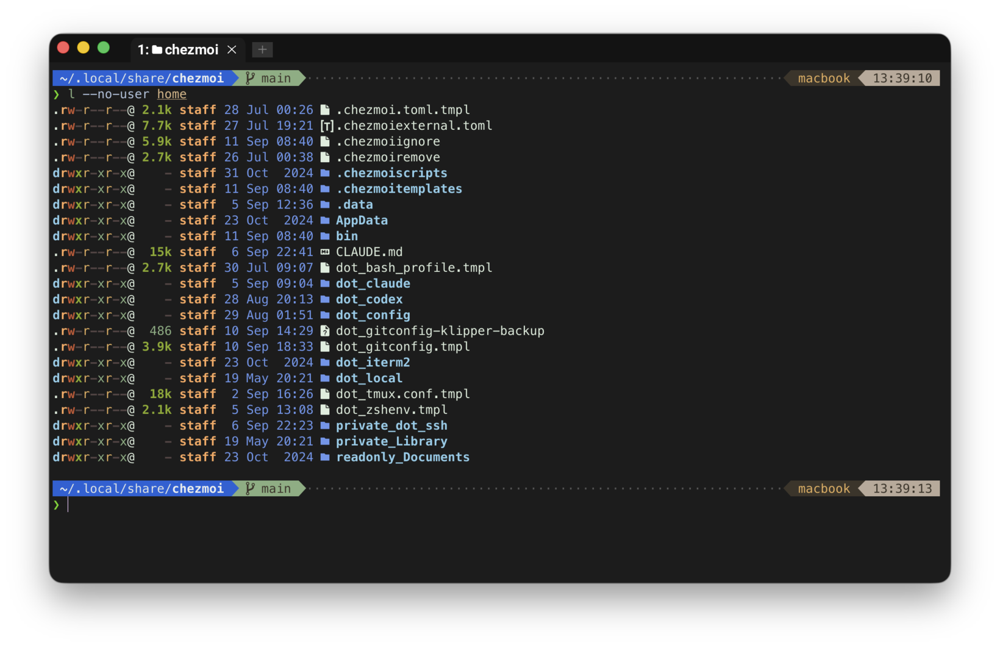
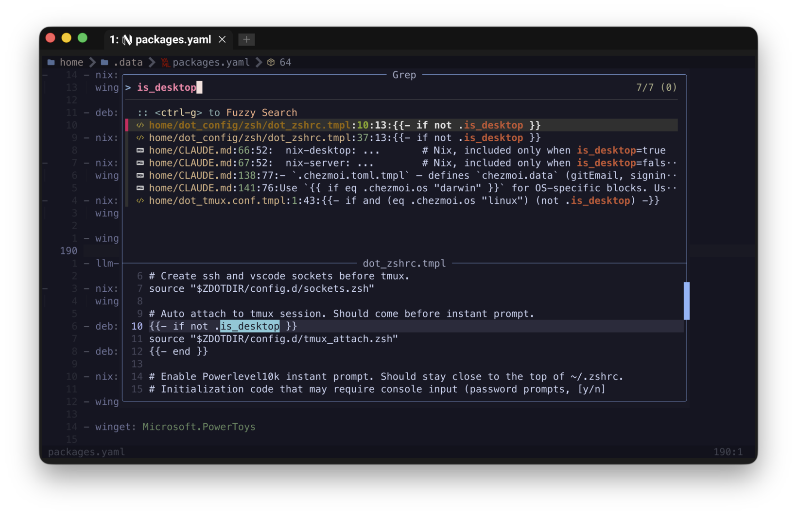
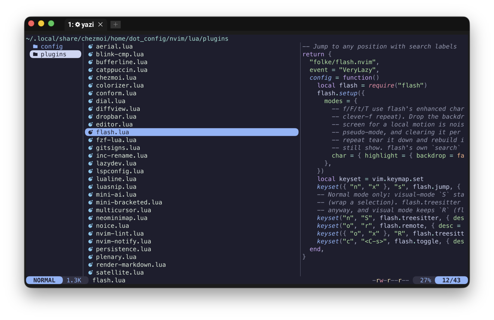
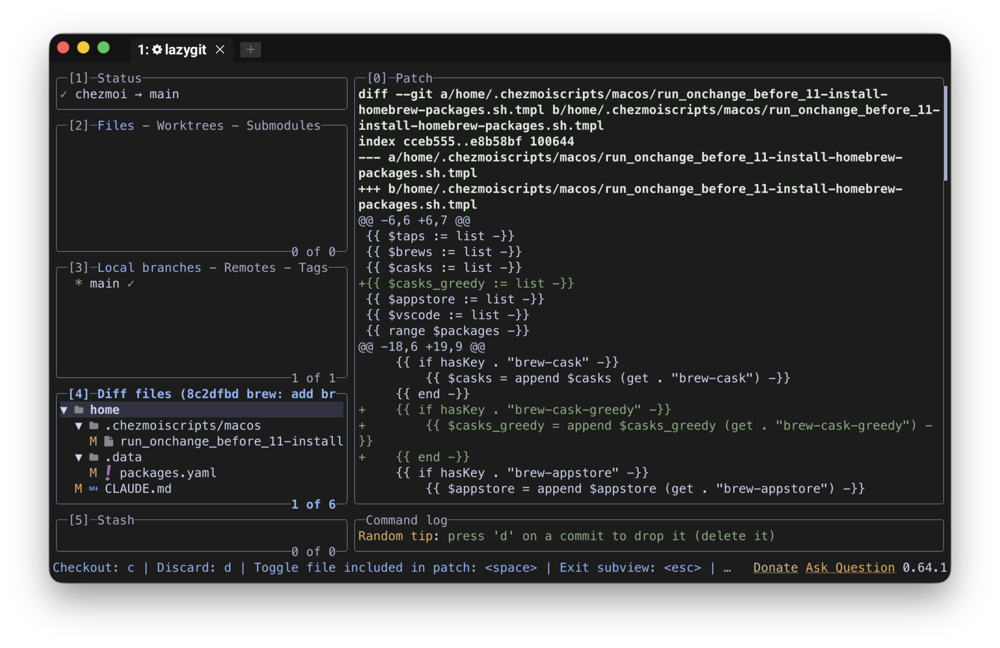

<h1 align="center">
    <a name="top" title="dotfiles">Dotfiles</a><br/><sup><sub>powered by  <a href="https://www.chezmoi.io/">chezmoi</a> 🏠</sub></sup>
</h1>

[![License][badge-license]][link-license]

My personal dotfiles, maintained since 2021 across macOS, Linux, Windows, Raspberry Pis and cloud workspaces. Managed with [chezmoi](https://www.chezmoi.io/): one package manifest for every platform, templates that adapt to each machine's role, and a config that is tested before it is committed.

Pieces worth borrowing include SSH agent forwarding that survives tmux reconnects, pane navigation that works the same through WezTerm, tmux and Neovim, and server alerts with enough detail to act on.

<p align="center"><br><sub>zsh with powerlevel10k in WezTerm. The prompt carries the path, git state and host; the listing is eza.</sub></p>

## 🧲 Things to borrow

Each of these solves a recognizable problem and is self-contained enough to lift out.

- **An SSH agent that survives tmux reconnects.** `SSH_AUTH_SOCK` points at a stable symlink, and every new connection re-points it, so panes opened hours ago keep a working agent. [`sockets.zsh`](home/dot_config/zsh/config.d/sockets.zsh.tmpl) exports the path; [`.zshenv`](home/dot_zshenv.tmpl) refreshes the link, including for non-interactive `ssh host command` sessions.
- **One package manifest across installers.** [`packages.yaml`](home/.data/packages.yaml) names each package once, with a key per installer, and the [install scripts](home/.chezmoiscripts) read it and run nix, Homebrew, apt, winget or scoop as appropriate. Details in [Packages](#-packages).
- **Consistent pane navigation through WezTerm, tmux and Neovim.** `Alt+hjkl` is forwarded down the chain to whichever layer should handle it, using user variables set over OSC so it also works over SSH. The comment block above the keymaps in [`wezterm.lua`](home/dot_config/wezterm/wezterm.lua) explains the forwarding rules and their corner cases.
- **Nix recovery when a terminal starts before `/nix` mounts.** On macOS the Nix volume mounts a few seconds after login, and a restored terminal can beat it and silently run without Nix. [`nix_heal.zsh`](home/dot_config/zsh/config.d/nix_heal.zsh) detects that state and repairs the shell once the volume appears.
- **Reboot alerts that name the packages.** [`node-exporter-reboot-required`](home/bin/executable_node-exporter-reboot-required) exports which packages asked for the reboot and which kernel would boot, so an alert reads "libc6, no kernel change" rather than "reboot required".

Smaller pieces:

- `git next` and `git prev` ([`git-checkout-next.sh`](home/bin/executable_git-checkout-next.sh)): walk first-parent history in either direction.
- `git fixup <commit>` ([`git-fixup.sh`](home/bin/executable_git-fixup.sh)): fold the staged changes into an older commit with an autosquash rebase.
- [`auto_title.zsh`](home/dot_config/zsh/config.d/auto_title.zsh): shorten the terminal title to unique path prefixes.
- [`scp-speed`](home/bin/executable_scp-speed): measure throughput to a host.
- [Touch ID for `sudo`](home/.chezmoiscripts/macos/run_onchange_before_05-macos-touchid-sudo.sh.tmpl): uses `sudo_local`, which survives macOS updates.
- [`blink/arthur.js`](blink/arthur.js): the same colour palette for Blink Shell on iOS.

## 🧭 How it is organized

- **Pinned Nix dependencies and shell plugins.** `flake.lock` is committed and every zsh plugin is pinned to a commit; one `bump-locks` run updates them together, as one commit to review. Neovim plugins and a few downloaded themes deliberately roll forward on their own.
- **Mostly organized by role.** Templates branch on `is_desktop` and `is_container` rather than on machine names.
- **Tested before commit.** Rendered shell templates are syntax-checked and shellchecked, the tmux config is loaded into a throwaway server, the Neovim config has a headless test suite, and pre-commit checks for accidentally committed secrets. See [Tests](#-tests) for the exact scope.

## 📦 Packages

[`home/.data/packages.yaml`](home/.data/packages.yaml) is the only place a package is named. An entry lists how to install the same thing everywhere:

```yaml
- nix: ripgrep
  winget: BurntSushi.ripgrep.MSVC
```

CLI tools come from Nix on macOS and Linux. The flake is generated from this file, and the committed `flake.lock` makes every host resolve identical versions. GUI apps use Homebrew casks, apt or winget. AI coding agents come from the [`llm-agents.nix`](https://github.com/numtide/llm-agents.nix) flake, which tracks upstream faster than nixpkgs.

The install scripts under [`home/.chezmoiscripts/`](home/.chezmoiscripts) read the manifest and run the right installer for the platform. Package installation re-runs when its inputs change, including the manifest and, for Nix, the lockfile.

## 🐚 Shell

zsh with [antidote](https://github.com/mattmc3/antidote) as the plugin manager and [powerlevel10k](https://github.com/romkatv/powerlevel10k) as the prompt, plus fzf-tab, fast-syntax-highlighting, autosuggestions, zoxide and the Oh My Zsh library. The config is split into small files under [`config.d/`](home/dot_config/zsh/config.d), one concern each, so a change to key bindings or history settings touches one file. The agent-socket and Nix-recovery pieces above live here too.

## ✍️ Neovim

A Lua config on lazy.nvim, one spec file per plugin under [`lua/plugins/`](home/dot_config/nvim/lua/plugins). fzf-lua does the finding, blink.cmp the completion, conform and nvim-lint the formatting and linting, with language servers for Lua, Python, Go, Rust, Bash, Nix, YAML, TOML, JSON, Markdown and Terraform.

Two decisions are worth knowing about:

- **No persistent undo or ShaDa writes for sensitive files.** A file under `~/.ssh`, or a chezmoi decrypted temp file, gets no undo file and no ShaDa entry, and a `:saveas` into `~/.ssh` is caught too. This behaviour is [tested](tests/nvim/spec/behaviors_spec.lua).
- **Plugins update during `chezmoi apply`, at most once per week.** Each machine keeps its own `lazy-lock.json`.

<p align="center"><br><sub>Searching the dotfiles with fzf-lua, with matching code previewed below.</sub></p>

## 🖥️ Terminal

[`wezterm.lua`](home/dot_config/wezterm/wezterm.lua) sets the Arthur colour scheme and MesloLGS Nerd Font, and derives the tab bar colours from the scheme so a scheme change carries through. The `Alt+hjkl` forwarding described above lives here.

Servers do not run WezTerm. They get [tmux](home/dot_tmux.conf.tmpl) with catppuccin, tmux-resurrect and continuum, per-pane window titles, and OSC 52 passthrough so a copy inside a remote tmux lands in the local clipboard. An SSH login attaches to the tmux session automatically.

[yazi](home/dot_config/yazi) is the file manager, both from the shell and from inside Neovim. There is a matching theme for [Blink Shell](blink/arthur.js) so the phone terminal looks the same.

<p align="center"><br><sub>yazi in the Neovim plugin directory, with the selected file previewed on the right.</sub></p>

## 🌿 Git

Commits are SSH-signed with the key from the GitHub account the repo was cloned from. [delta](https://github.com/dandavison/delta) renders diffs, paged by `ov`. `pull.rebase` is on globally, with a per-directory include for the one repo that must not rebase. [`.gitconfig`](home/dot_gitconfig.tmpl) also carries the aliases mentioned above, plus `git undo`, `git uncommit` and `git unamend` for backing out of the last step.

<p align="center"><br><sub>lazygit on this repository, showing the commit that added a manifest key and the Brewfile template that consumes it.</sub></p>

## 🔐 Secrets and machine roles

Secrets are encrypted with [age](https://age-encryption.org/) and committed: the SSH config, and the age identity itself, which is stored passphrase-protected in [`home/.data/key.txt.age`](home/.data/key.txt.age) and decrypted once on a new machine.

On a fresh machine `chezmoi init` asks for a name and email, and on Linux whether the machine is a desktop. Inside a container it asks nothing: Coder workspaces and CI are detected from the environment, get a non-interactive setup, and skip most install scripts, keeping only the Nix profile sync, npm packages, agent plugins, the login shell and the workspace git key.

## 🛠️ Servers and monitoring

Linux servers get a set of small exporters in [`home/bin/`](home/bin) for node_exporter's textfile collector:

- `node-exporter-reboot-required`: the reboot alert described above.
- `node-exporter-ssl-certs`: TLS expiry read from what is actually served, not only from the file on disk.
- WireGuard and xray health, Raspberry Pi throttling flags, the freshness of a 3D printer's config backup, an end-to-end healthcheck for a Loki/Grafana logging stack, and an external watchdog that pages when the monitoring host itself dies.

A sync script updates selected system helpers only where they are already installed, so a server never grows a job it was not set up with. A separate script installs the fastfetch MOTD on Debian and Ubuntu.

## 🧰 macOS and Windows extras

- **macOS:** a Brewfile generated from the manifest; Touch ID for `sudo` through `/etc/pam.d/sudo_local`; key repeat instead of the accent popup; and a single keyboard layout that holds both Latin and Cyrillic, switched with Caps Lock, so the Caps Lock light shows which script is active and the system layout switcher is never needed.
- **Windows:** winget and scoop from the same manifest, a PowerShell profile with completions, developer mode, the hardware clock set to UTC for dual boot, and Neovim plugins kept in sync as on Unix.

## 🤖 AI agent tooling

Coding agents (Claude Code, Codex, omp) are installed like any other package, and their plugins are listed in the manifest too. Claude Code skills under [`home/dot_claude/skills/`](home/dot_claude/skills) cover driving TUIs from an agent (`agent-tty`) and the terminal orchestrator used to run several sessions side by side (`herdr`). Inside a Coder workspace the SSH agent is opt-in per shell (`ssh-agent-on`), so an agent does not get keys it does not need.

## ✅ Tests

- [`tests/shell/run.sh`](tests/shell/run.sh) renders the zsh files and the shell-script templates with the current host's chezmoi data, runs `zsh -n` and shellcheck on the result, and loads the rendered tmux config into a throwaway server. Branches gated to other hosts render empty and are not exercised, and a check is skipped with a note if its tool is missing.
- [`tests/nvim/run.sh`](tests/nvim/run.sh) runs a plenary/busted suite against the source config, isolated from whatever is deployed on the host.
- [pre-commit](.pre-commit-config.yaml) runs both, plus gitleaks, private-key detection, stylua, luacheck and the usual hygiene hooks.

## 🗺️ Layout

| Path | What lives there |
|---|---|
| [`home/`](home) | chezmoi source, mapped onto `$HOME` (`dot_` becomes `.`, `private_` means mode 600, `.tmpl` is a Go template) |
| [`home/.data/packages.yaml`](home/.data/packages.yaml) | the package manifest |
| [`home/.chezmoiscripts/`](home/.chezmoiscripts) | install and setup scripts per platform, re-run when their content changes |
| [`home/.chezmoiexternal.toml`](home/.chezmoiexternal.toml) | themes, fonts, tmux plugins and binaries fetched on apply |
| [`home/dot_config/`](home/dot_config) | zsh, Neovim, WezTerm, yazi, lazygit and the rest |
| [`home/bin/`](home/bin) | user scripts and the exporters |
| [`home/CLAUDE.md`](home/CLAUDE.md) | the long-form architecture notes, written for AI agents and just as useful for humans |
| [`docs/screenshots/`](docs/screenshots) | the images above and the script that stages them |
| [`tests/`](tests) | the shell and Neovim test suites |
| [`blink/`](blink) | the Blink Shell theme |

## ⚠️ Try it yourself (carefully)

Please do not apply this repo as-is. It replaces the login shell, installs about 140 packages, enables Touch ID for sudo on macOS and turns off UAC prompts on Windows. Fork it first, then:

1. Replace [`home/.data/key.txt.age`](home/.data/key.txt.age) with a passphrase-encrypted copy of your own age identity, set your recipient in [`home/.chezmoi.toml.tmpl`](home/.chezmoi.toml.tmpl), and replace the other encrypted files with yours.
2. Prune [`home/.data/packages.yaml`](home/.data/packages.yaml) down to what you actually use.

Git identity is not baked in: `chezmoi init` asks for a name and email, and the signing key is looked up on the GitHub account the repo was cloned from.

Then, on Unix:

```sh
sh -c "$(curl -fsLS get.chezmoi.io)" -- -b ~/.local/bin init --apply <your-github-username>
```

On Windows, in `powershell.exe` (not pwsh):

```powershell
iex "&{$(irm 'https://get.chezmoi.io/ps1')} -b ~/.local/bin -- init --apply <your-github-username>"
```

From then on, `chezmoi update` pulls and applies the latest changes on any machine, and `chezmoi diff` shows what would change before it does.

## 📄 License

[MIT](LICENSE). Take what is useful.

[badge-license]:https://img.shields.io/github/license/KapJI/dotfiles.svg?logo=data:image/svg+xml;base64,PD94bWwgdmVyc2lvbj0iMS4wIiBlbmNvZGluZz0iVVRGLTgiPz48IURPQ1RZUEUgc3ZnIFBVQkxJQyAiLS8vVzNDLy9EVEQgU1ZHIDEuMS8vRU4iICJodHRwOi8vd3d3LnczLm9yZy9HcmFwaGljcy9TVkcvMS4xL0RURC9zdmcxMS5kdGQiPjxzdmcgeG1sbnM9Imh0dHA6Ly93d3cudzMub3JnLzIwMDAvc3ZnIiB4bWxuczp4bGluaz0iaHR0cDovL3d3dy53My5vcmcvMTk5OS94bGluayIgdmVyc2lvbj0iMS4xIiB3aWR0aD0iMjQiIGhlaWdodD0iMjQiIHZpZXdCb3g9IjAgMCAyNCAyNCI+PHBhdGggZD0iTTE3LjgsMjBDMTcuNCwyMS4yIDE2LjMsMjIgMTUsMjJINUMzLjMsMjIgMiwyMC43IDIsMTlWMThINUwxNC4yLDE4QzE0LjYsMTkuMiAxNS43LDIwIDE3LDIwSDE3LjhNMTksMkMyMC43LDIgMjIsMy4zIDIyLDVWNkgyMFY1QzIwLDQuNCAxOS42LDQgMTksNEMxOC40LDQgMTgsNC40IDE4LDVWMThIMTdDMTYuNCwxOCAxNiwxNy42IDE2LDE3VjE2SDVWNUM1LDMuMyA2LjMsMiA4LDJIMTlNOCw2VjhIMTVWNkg4TTgsMTBWMTJIMTRWMTBIOFoiIGZpbGw9IiNmZmZmZmYiIC8+PC9zdmc+Cg==&maxAge=86400
[link-license]:LICENSE
